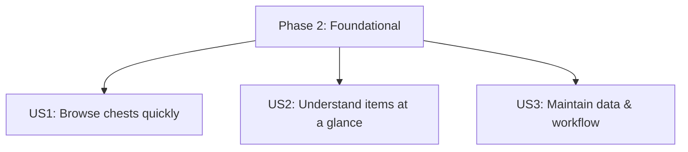

# Tasks: Chests Cleanup

**Input**: Design documents in `specs/003-chests-cleanup/` (`plan.md`, `spec.md`, `research.md`, `data-model.md`, `quickstart.md`, `contracts/`)

**Tests**: No automated tests requested in the spec; verification is via the independent manual test steps per user story.

**Organization**: Tasks are grouped by user story (US1–US3) so each story can be implemented and validated independently.

## Format: `[ID] [P?] [Story] Description with file path`

- **[P]**: Can run in parallel (different files, no dependencies)
- **[Story]**: Which user story this task belongs to (e.g. `[US1]`)
- Every task includes an explicit file path

---

## Phase 1: Setup (Shared Infrastructure)

**Purpose**: Establish the required page/component structure without changing behavior.

- [ ] T001 [P] Create reusable header component in src/components/Header.tsx
- [ ] T002 [P] Create reusable footer component in src/components/Footer.tsx
- [ ] T003 [P] Create reusable navigation component in src/components/Navigation.tsx
- [ ] T004 Wire extracted layout components into routing shell in src/App.tsx

---

## Phase 2: Foundational (Blocking Prerequisites)

**Purpose**: Move code into the required structure and unify generator/UI data contracts so user stories build on the final architecture.

**⚠️ CRITICAL**: No user story work should start until this phase is complete.

- [ ] T005 Move loot-table shared UI helpers from src/features/loot-tables/shared/* to src/pages/loot-tables/shared/* and update imports
- [ ] T006 Move Chests page module files from src/features/loot-tables/chests/* to src/pages/loot-tables/chests/* and fix relative imports
- [ ] T007 Update route imports to new page-based path in src/App.tsx

- [ ] T008 Update the canonical index contract to represent the index file as an array of entries in src/models/jsonIndex.ts
- [ ] T009 Refactor chest generator to use canonical models and new rules in transformer/loot_tables/chests.ts (TieredLootTable + JsonIndex, concise filenames using suffix-only `_chest` removal, skip treasure, emit index entries in display order)
- [ ] T010 Align generator entrypoint with the refactor in transformer/bin/generate-loot-tables.ts

- [ ] T011 Update Chests page data loading to use canonical models in src/pages/loot-tables/chests/ChestsPage.tsx (load JsonIndex entries and fetch TieredLootTable)
- [ ] T012 Update computation pipeline to consume TieredLootTable in src/pages/loot-tables/chests/expectedValue.ts, src/pages/loot-tables/chests/quantity.ts, src/pages/loot-tables/chests/rarity.ts, src/pages/loot-tables/chests/aggregateByItemId.ts
- [ ] T013 Remove deprecated published model types in src/models/published_chest_loot_table.ts and update remaining imports to src/models/tieredLootTable.ts

- [ ] T014 Regenerate and commit published loot table outputs under public/data/loot_tables/ (rename chest files using suffix-only `_chest` removal, remove treasure, update index.json ordering)
- [ ] T015 Keep JSON schema docs aligned with the final published output in specs/003-chests-cleanup/contracts/jsonIndex.schema.json and specs/003-chests-cleanup/contracts/tieredLootTable.schema.json
- [ ] T016 Verify no OpenAPI contract exists and remove it if found; document the confirmation in specs/003-chests-cleanup/contracts/README.md

**Checkpoint**: Foundation ready — user story work can proceed.

---

## Phase 3: User Story 1 — Browse chests quickly (Priority: P1) 🎯 MVP

**Goal**: Per-chest layout, predictable ordering, and search on Loot Table → Chests.

**Independent Test**: Open `#/loot-table/chests` and verify: per-chest sections render, ordering is Wooden→Living→Gilded→Ornate→Hardened→Flesh→Enigma, search filters sections, Treasure is not visible.

- [ ] T017 [US1] Render chest sections in JsonIndex entry order (no additional UI-side sorting) in src/pages/loot-tables/chests/ChestsPage.tsx
- [ ] T018 [US1] Ensure JsonIndex entry order matches the required category order (Wooden → Living → Gilded → Ornate → Hardened → Flesh → Enigma) in transformer/loot_tables/chests.ts
- [ ] T019 [US1] Render each chest as its own section with a visible header in src/pages/loot-tables/chests/ChestsTable.tsx
- [ ] T020 [US1] Add chest search input and filter logic (including “no matches” state); query matches both derived display label and raw chest id in src/pages/loot-tables/chests/ChestsPage.tsx
- [ ] T021 [US1] Defensively exclude Treasure from rendering even if present in data in src/pages/loot-tables/chests/ChestsPage.tsx
- [ ] T022 [US1] Make settings controls consistent and accessible (labels/spacing/keyboard) in src/pages/loot-tables/chests/ChestsControls.tsx

**Checkpoint**: US1 is fully functional and demoable on its own.

---

## Phase 4: User Story 2 — Understand items at a glance (Priority: P2)

**Goal**: Friendly item names and a clearer table while keeping tier-based background cues.

**Independent Test**: Open `#/loot-table/chests` and verify: item ids render as friendly names (e.g. `minecraft:diamond_sword` → “Diamond Sword”) and the table remains legible with tier background styling preserved.

- [ ] T023 [P] [US2] Implement item id → friendly label formatter in src/pages/loot-tables/chests/formatItemName.ts
- [ ] T024 [US2] Display friendly item names in src/pages/loot-tables/chests/ChestsTable.tsx (keep raw id accessible via title/aria-label)
- [ ] T025 [US2] Improve table borders/spacing/typography while preserving tier backgrounds in src/pages/loot-tables/chests/ChestsTable.tsx and src/pages/loot-tables/chests/tierStyles.ts

**Checkpoint**: US2 improvements are visible without changing US1 behavior.

---

## Phase 5: User Story 3 — Maintain data and codebase efficiently (Priority: P3)

**Goal**: Debug-friendly generation workflow (no committed transformer build output) and maintainable structure.

**Independent Test**: Run `yarn generate:loot-tables` and confirm it runs from TypeScript source, produces the expected outputs, and `transformer/dist/` is not reintroduced.

- [ ] T026 [US3] Switch generation workflow to run transformer from TS source (add tsx, update scripts) in package.json
- [ ] T027 [US3] Add transformer typecheck script (no emit) in package.json and ensure config works in tsconfig.transformer.json
- [ ] T028 [US3] Delete committed transformer build artifacts under transformer/dist/** and ensure ignore rule remains in .gitignore
- [ ] T029 [US3] Update developer documentation to match the new workflow and output naming in specs/003-chests-cleanup/quickstart.md

**Checkpoint**: Maintainers can regenerate data without build artifacts.

---

## Phase 6: Polish & Cross-Cutting Concerns

**Purpose**: Final cleanup and quality gates across the entire feature.

- [ ] T030 [P] Update any remaining internal docs referencing old paths/contracts in specs/003-chests-cleanup/plan.md and specs/003-chests-cleanup/data-model.md
- [ ] T031 Run lint/build gates and fix any issues in touched files under src/** and transformer/** (via scripts in package.json)

---

## Dependencies & Execution Order

### Phase Dependencies

- Phase 1 (Setup) → Phase 2 (Foundational) → User Stories (Phases 3–5) → Phase 6 (Polish)

### User Story Dependencies

- **US1 (P1)**: Depends on Foundational (Phase 2); no dependency on US2/US3
- **US2 (P2)**: Depends on Foundational (Phase 2); no dependency on US1/US3
- **US3 (P3)**: Depends on Foundational (Phase 2); no dependency on US1/US2

### Dependency Graph (User Stories)

---

## Parallel Execution Examples

### Parallel Example: Setup (Phase 1)

- Create layout components independently:
  - T001 (src/components/Header.tsx)
  - T002 (src/components/Footer.tsx)
  - T003 (src/components/Navigation.tsx)

### Parallel Example: User Story 1

- (No dedicated parallelizable helper task; chest ordering comes from JsonIndex order.)

### Parallel Example: User Story 2

- T023 can be implemented in parallel with other non-overlapping work because it is isolated to src/pages/loot-tables/chests/formatItemName.ts

---

## Implementation Strategy

### MVP First (US1 Only)

1. Complete Phase 1 + Phase 2 (required architecture + contracts)
2. Complete Phase 3 (US1)
3. Validate US1 independent test scenarios on `#/loot-table/chests`

### Incremental Delivery

1. Foundation → US1 (MVP) → US2 → US3 → Polish
2. Keep each story independently testable after it lands
